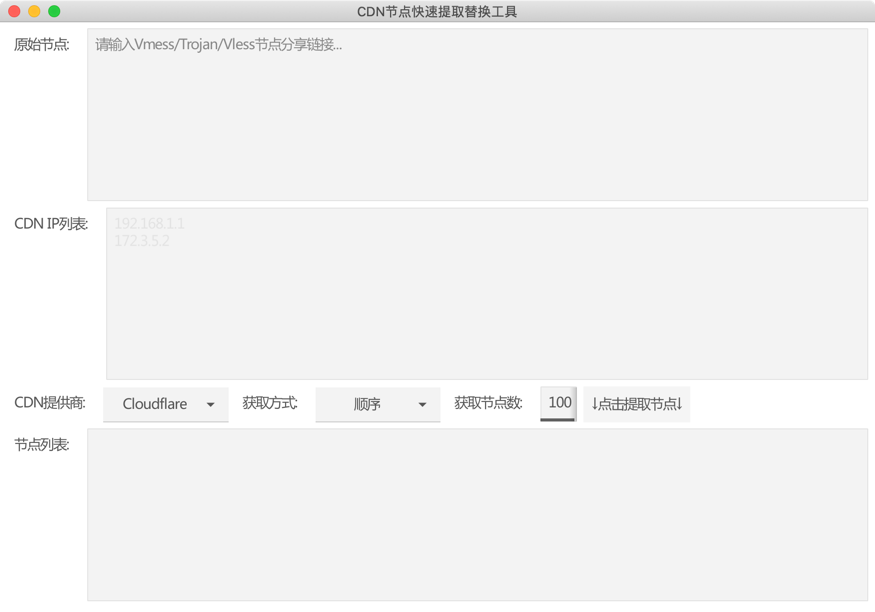
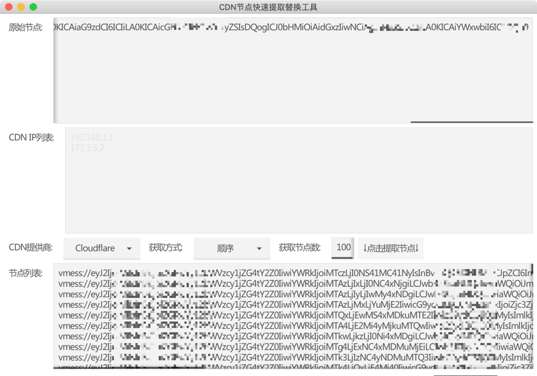
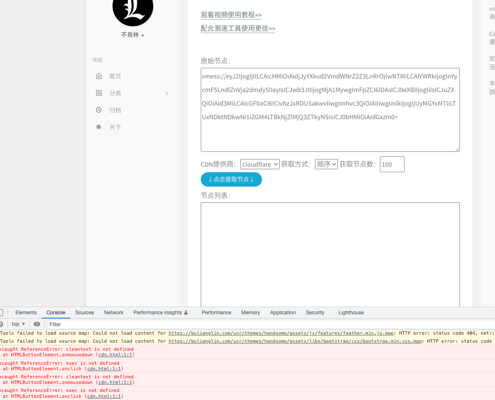

# proxy-node2more

A GUI tool to help you to make your vmess/vless/trojan node to more nodes with cloudflare/gcore/cloudfront cdn.

# 说明
### 必要条件:
首先需要保证节点确实使用了cloudflare/cloudfront/gcore 任意一家的cdn服务,并且确保节点---> cdn 链路是通的。

然后将节点粘贴到程序的原始节点输入框，选择cdn选项，然后生成节点即可。

[视频参考](https://www.youtube.com/watch?v=Mme5yaLQE7Y&t=373s)

[nodesCatch节点测速工具](https://github.com/bulianglin/demo/blob/main/nodesCatch-V2.0.rar?raw=true)

[林哥在线生成工具](https://bulianglin.com/archives/cdn.html) 截止到2023.3.20号目前无法正常使用

林哥的在线工具无法使用，所以开发了这个小工具

该程序就是替换vmess/vless/trojan中的host地址，并将host替换为给定的IP，仅此而已。

# 使用
在release页面下载对应平台的压缩包到本地，解压缩执行可执行文件即可。
然后填入需要替换cdn ip的节点，就可以将1个节点生成几百几千个节点(如果你想的话)

# 最后
如果该项目有帮到您的话,star是对我最大的支持。
